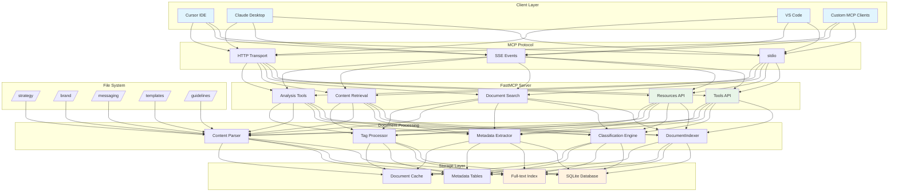
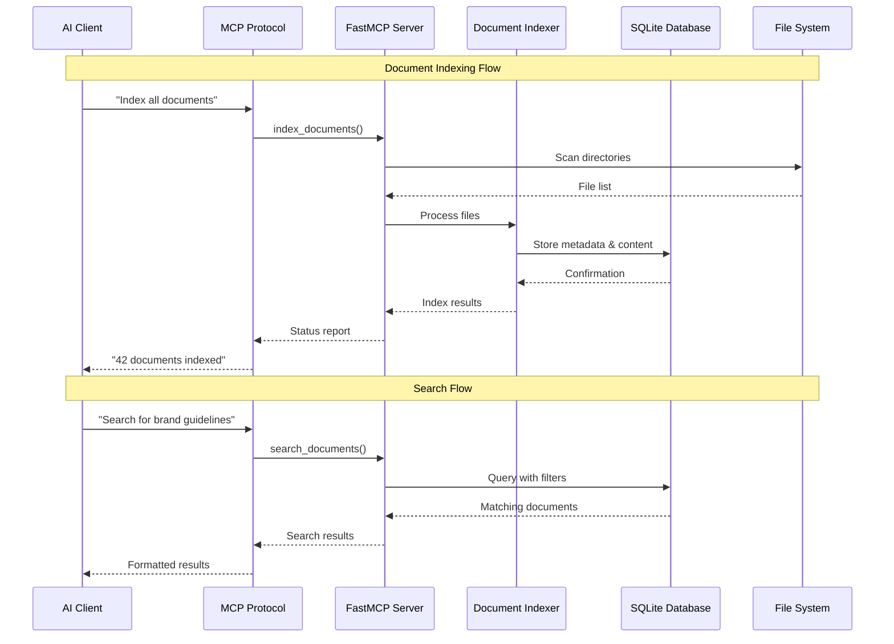
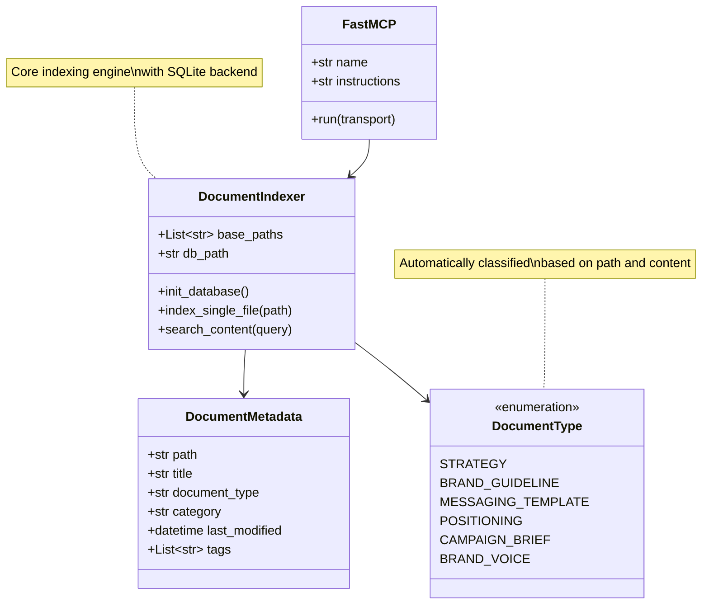

# BrandNexus

[](https://python.org)
[](https://fastmcp.dev)
[](LICENSE)
[]()

> **An intelligent MCP server that seamlessly connects your strategy documents, brand guidelines, and messaging templates to AI-powered workflows through Claude Desktop, Cursor IDE, and VS Code.**

**BrandNexus** transforms how organizations manage and access strategic content by creating an intelligent bridge between documents and AI assistants, enabling instant search, automatic classification, and contextual access to organizational knowledge.

---

## 🚀 Quick Start

Get BrandNexus running in under 5 minutes:

```bash
# 1. Clone and setup
git clone https://github.com/yourusername/brandnexus.git
cd brandnexus

# 2. Run automated deployment
chmod +x deploy_mcp_server.sh
./deploy_mcp_server.sh

# 3. Configure your AI client (Claude Desktop example)
# Edit ~/.config/claude-desktop/claude_desktop_config.json
```

**Start using immediately:**
- "Index all strategy documents"
- "Search for brand guidelines about logo usage"
- "Find messaging templates for product launches"

---

## 📋 Table of Contents

- [🏗️ Architecture](#️-architecture)
- [✨ Features](#-features)
- [⚡ Installation](#-installation)
- [⚙️ Configuration](#️-configuration)
- [🎯 Usage](#-usage)
- [🔌 Client Integration](#-client-integration)
- [📚 API Reference](#-api-reference)
- [🔬 Development](#-development)
- [🚀 Advanced Features](#-advanced-features)
- [🛠️ Troubleshooting](#️-troubleshooting)
- [🤝 Contributing](#-contributing)

---

## 🏗️ Architecture

BrandNexus implements a layered architecture using the Model Context Protocol (MCP) for seamless AI integration:



### Document Processing Workflow



---

## ✨ Features

### 🎯 Core Functionality
- **🔍 Intelligent Search**: Natural language queries across all content
- **🏷️ Smart Classification**: Auto-categorizes documents by type and content
- **📊 Real-time Indexing**: Automatically updates when documents change
- **🔗 AI Integration**: Native support for Claude Desktop, Cursor IDE, VS Code
- **📁 Multi-format Support**: Markdown, PDF, Word, YAML, JSON, and more

### 🧠 AI-Powered Features
- **🔍 Semantic Search**: Vector-based similarity matching
- **🤖 ML Classification**: Machine learning document categorization
- **📈 Relationship Analysis**: Discover connections between documents
- **💡 Content Insights**: Automated summaries and tag extraction

### 🛡️ Enterprise Ready
- **🔐 Security**: JWT authentication and path validation
- **⚡ Performance**: Caching and background processing
- **📊 Monitoring**: Health checks and usage analytics
- **🔧 Configurable**: Flexible setup for any organization

---

## ⚡ Installation

### Prerequisites

- **Python 3.8+** (Required)
- **Git** (For cloning repository)
- **500MB RAM** minimum (2GB+ recommended)

### Automatic Installation

```bash
# Clone repository
git clone https://github.com/yourusername/brandnexus.git
cd brandnexus

# Run automated deployment
chmod +x deploy_mcp_server.sh
./deploy_mcp_server.sh
```

<details>
<summary>🔧 Manual Installation Steps</summary>

```bash
# 1. Install Python dependencies
pip install fastmcp sqlite3 pathlib pyyaml

# Optional: Enhanced document processing
pip install python-docx PyPDF2 markdown

# Optional: Advanced features
pip install scikit-learn sentence-transformers faiss-cpu

# 2. Create directory structure
mkdir -p strategy brand messaging templates guidelines

# 3. Initialize configuration
cp .env.example .env
# Edit .env with your specific paths

# 4. Initialize database
python domain_specific_mcp_server.py --init-db
```

</details>

### Verification

```bash
# Test server functionality
python domain_specific_mcp_server.py --health-check

# Expected output:
# ✅ Database connection: OK
# ✅ Document paths accessible: OK
# ✅ Server ready for MCP clients
```

---

## ⚙️ Configuration

### Directory Structure Setup

Organize your documents following this structure:

```
your-project/
├── strategy/                    # 📈 Strategic documents
│   ├── company-strategy-2025.md
│   ├── product-roadmap.md
│   └── market-analysis.pdf
├── brand/                       # 🎨 Brand guidelines  
│   ├── brand-guidelines.md
│   ├── logo-usage.md
│   ├── color-palette.yaml
│   └── typography-guide.pdf
├── messaging/                   # 💬 Templates and copy
│   ├── email-templates/
│   ├── social-media-templates/
│   └── press-release-formats/
├── templates/                   # 📋 Additional templates
└── guidelines/                  # 📚 Other guidelines
```

### Environment Configuration

Create a `.env` file in your project root:

```bash
# Document paths (comma-separated)
DOCUMENT_PATHS=./strategy/,./brand/,./messaging/,./templates/,./guidelines/

# Database configuration
DATABASE_PATH=document_index.db

# Server settings
SERVER_NAME=BrandNexus Document Server
LOG_LEVEL=INFO

# Features
AUTO_REINDEX=true
REINDEX_INTERVAL=3600
ENABLE_SEMANTIC_SEARCH=false
ENABLE_ML_CLASSIFICATION=false
```

<details>
<summary>📄 Advanced Configuration (config.yaml)</summary>

```yaml
server:
  name: "BrandNexus Document Server"
  version: "1.0.0"

paths:
  strategy: "./strategy/"
  brand: "./brand/"
  messaging: "./messaging/"

indexing:
  supported_extensions: [".md", ".txt", ".docx", ".pdf", ".yaml"]
  exclude_patterns: ["*.tmp", ".*", "__pycache__"]
  auto_reindex: true

classification:
  rules:
    strategy:
      path_patterns: ["/strategy/", "strategy"]
      keywords: ["roadmap", "objectives", "goals"]
    brand:
      path_patterns: ["/brand/", "brand"]  
      keywords: ["guidelines", "identity", "voice"]
```

</details>

---

## 🎯 Usage

### Starting the Server

```bash
# Start as MCP server (stdio mode)
python domain_specific_mcp_server.py

# Or with custom configuration
python domain_specific_mcp_server.py --config config.yaml
```

### Basic Operations

Once connected through an AI client, use natural language:

#### 📂 Document Management
```
"Index all documents"
"Refresh the document index" 
"Show indexing status"
```

#### 🔍 Searching Content
```
"Find strategy documents about customer acquisition"
"Search for brand guidelines on logo usage"
"Show me messaging templates for product launches"
"Find all documents mentioning 'sustainability'"
```

#### 📄 Content Access
```
"Get the content of our brand voice guide"
"Show me the latest strategy document"
"Display all email templates"
```

#### 📊 Analysis & Insights
```
"Analyze relationships between documents"
"Show document type distribution"
"What are the most common tags?"
```

### Document Types

BrandNexus automatically classifies documents:

| Type | Description | Examples |
|------|-------------|----------|
| **Strategy** | Company strategies, roadmaps | `company-strategy-2025.md` |
| **Brand Guidelines** | Visual identity, brand voice | `logo-usage.md`, `brand-voice.md` |
| **Messaging Templates** | Email, social, campaign copy | `email-templates/`, `social-copy/` |
| **Positioning** | Market positioning docs | `competitive-analysis.md` |
| **Campaign Briefs** | Campaign strategies | `campaign-brief-q4.md` |

---

## 🔌 Client Integration

### Claude Desktop

<details>
<summary>🖥️ Setup Instructions</summary>

1. **Install Claude Desktop** from [Anthropic's website](https://claude.ai/desktop)

2. **Configure MCP Server**:
   Edit `~/.config/claude-desktop/claude_desktop_config.json`:
   ```json
   {
     "mcpServers": {
       "brandnexus": {
         "command": "python3",
         "args": ["/absolute/path/to/domain_specific_mcp_server.py"],
         "env": {
           "DOCUMENT_PATHS": "/path/to/strategy/,/path/to/brand/,/path/to/messaging/"
         }
       }
     }
   }
   ```

3. **Restart Claude Desktop** and start using document-aware conversations!

</details>

### Cursor IDE

<details>
<summary>💻 Setup Instructions</summary>

1. **Install Cursor IDE** from [cursor.sh](https://cursor.sh)

2. **Configure MCP Integration**:
   Create `.cursor/mcp.json` in your workspace:
   ```json
   {
     "mcpServers": {
       "brandnexus": {
         "command": "python",
         "args": ["./domain_specific_mcp_server.py"],
         "env": {
           "DOCUMENT_PATHS": "./strategy/,./brand/,./messaging/"
         }
       }
     }
   }
   ```

3. **Use in Cursor**: Access documents while coding with AI assistance

</details>

### VS Code

<details>
<summary>🔧 Setup Instructions</summary>

1. **Install MCP Extension** (when available)

2. **Configure Server**:
   Create `.vscode/mcp.json`:
   ```json
   {
     "servers": {
       "brandnexus": {
         "type": "stdio", 
         "command": "python",
         "args": ["./domain_specific_mcp_server.py"]
       }
     }
   }
   ```

</details>

---

## 📚 API Reference

### MCP Tools

#### `index_documents()`
Scans and indexes all documents in configured directories.

**Returns:**
```json
{
  "indexed": 42,
  "updated": 5,
  "errors": [],
  "document_types": {
    "strategy": 12,
    "brand_guideline": 8,
    "messaging_template": 22
  }
}
```

#### `search_documents(query, document_type?, category?, limit?)`
Searches documents by content, title, or metadata.

**Parameters:**
- `query` (string): Search terms
- `document_type` (optional): Filter by document type
- `category` (optional): Filter by category  
- `limit` (optional): Maximum results (default: 10)

**Example Usage:**
```python
# Search for brand voice guidelines
search_documents("brand voice", document_type="brand_guideline", limit=5)

# Find all strategy documents mentioning "growth"
search_documents("growth", document_type="strategy")
```

#### `get_document_content(path)`
Retrieves the full content of a specific document.

**Example:**
```python
get_document_content("/brand/brand-voice.md")
```

#### `get_messaging_templates(category?)`
Returns available messaging templates, optionally filtered by category.

#### `get_brand_guidelines(section?)`
Retrieves brand guidelines, optionally filtered by section.

#### `analyze_document_relationships()`
Analyzes relationships and dependencies between documents.

### MCP Resources

Access documents through structured URI patterns:

| Pattern | Description | Example |
|---------|-------------|---------|
| `strategy://document/{doc_id}` | Strategy document access | `strategy://document/123` |
| `brand://guidelines/{section}` | Brand guideline sections | `brand://guidelines/logo` |
| `templates://messaging/{type}` | Messaging templates | `templates://messaging/email` |

---

## 🔬 Development

### Development Environment Setup

```bash
# Clone repository
git clone https://github.com/yourusername/brandnexus.git
cd brandnexus

# Create virtual environment
python -m venv venv
source venv/bin/activate  # On Windows: venv\Scripts\activate

# Install development dependencies
pip install -r requirements-dev.txt

# Run tests
python -m pytest tests/

# Run linting
flake8 domain_specific_mcp_server.py
black domain_specific_mcp_server.py
```

### Project Structure



### Code Style

- Follow PEP 8 for Python code
- Use type hints for all public functions
- Add docstrings for all public methods
- Maximum line length: 88 characters
- Use `black` for code formatting

### Testing

```bash
# Run all tests
pytest

# Run with coverage
pytest --cov=domain_specific_mcp_server

# Run specific test category
pytest tests/test_indexing.py
pytest tests/test_search.py
pytest tests/test_mcp_tools.py
```

---

## 🚀 Advanced Features

### Machine Learning Classification

Enable ML-powered document classification:

```bash
# Install ML dependencies
pip install scikit-learn

# Enable in configuration
export ENABLE_ML_CLASSIFICATION=true

# Train classifier (requires ≥10 classified documents)
python -c "
from domain_specific_mcp_server import mcp
result = mcp.train_document_classifier()
print(result)
"
```

### Semantic Search

Enable vector-based semantic search:

```bash
# Install semantic search dependencies  
pip install sentence-transformers faiss-cpu

# Enable in configuration
export ENABLE_SEMANTIC_SEARCH=true
```

**Usage Example:**
```python
# Hybrid search combining keywords and semantics
semantic_document_search(
    "company vision and strategic direction",
    semantic_weight=0.7,
    limit=10
)
```

### Real-time Monitoring

Enable automatic reindexing when files change:

```bash
# Install file monitoring dependencies
pip install watchdog

# Enable in configuration
export AUTO_REINDEX=true
```

### Performance Optimization

For large document sets:

```bash
# Enable caching (10 minute TTL)
export CACHE_TTL=600

# Increase search limits  
export MAX_SEARCH_RESULTS=50

# Use background processing
export BACKGROUND_INDEXING=true
```

---

## 🛠️ Troubleshooting

### Common Issues

#### ❌ Permission Denied Errors
```bash
# Ensure read access to document directories
chmod -R 755 ./strategy/ ./brand/ ./messaging/
```

#### ❌ Database Locked Errors  
```bash
# Close other connections and restart
python domain_specific_mcp_server.py --reset-db
```

#### ❌ Module Not Found Errors
```bash
# Reinstall dependencies
pip install --upgrade fastmcp sqlite3 pathlib pyyaml
```

#### ❌ Large Files Not Processing
```bash
# Enable streaming for files >10MB
export ENABLE_STREAMING=true
```

### Debug Mode

Enable detailed logging:

```bash
export DEBUG=true
export LOG_LEVEL=DEBUG
python domain_specific_mcp_server.py
```

### Health Check

Verify server status:

```python
from domain_specific_mcp_server import mcp
health = mcp.diagnose_server_health()
print(health)
```

### Getting Help

1. **📋 Check logs**: Look in `mcp_server.log` for error details
2. **⚙️ Verify config**: Ensure paths and permissions are correct  
3. **🧪 Test samples**: Use provided sample documents
4. **🔧 Check client**: Verify MCP client configuration

### Performance Issues

<details>
<summary>🚀 Optimization Tips</summary>

- **Large Document Sets**: Enable background indexing
- **Slow Searches**: Implement result caching
- **Memory Usage**: Use streaming for large files
- **Database Performance**: Regular VACUUM operations

</details>

---

## 🤝 Contributing

We welcome contributions! Here's how to get started:

### 🎯 Ways to Contribute

- 🐛 **Bug Reports**: Found an issue? [Open an issue](https://github.com/yourusername/brandnexus/issues)
- 💡 **Feature Requests**: Have an idea? [Start a discussion](https://github.com/yourusername/brandnexus/discussions)
- 📝 **Documentation**: Improve guides and examples
- 🧪 **Testing**: Expand test coverage
- 🔧 **Code**: Implement new features or fix bugs

### Development Workflow

1. **Fork the repository** on GitHub
2. **Create a feature branch**: `git checkout -b feature/amazing-feature`
3. **Make your changes** and add tests
4. **Run the test suite**: `pytest`
5. **Commit your changes**: `git commit -m "Add amazing feature"`
6. **Push to your fork**: `git push origin feature/amazing-feature`
7. **Open a Pull Request**

### 🎯 Priority Areas

- [ ] **New document types**: Support for additional file formats
- [ ] **Enhanced classification**: Improve ML classification algorithms  
- [ ] **Performance optimizations**: Optimize indexing and search
- [ ] **Security features**: Add authentication and authorization
- [ ] **UI components**: Web interface for document management

### Code Review Process

- All changes require review from maintainers
- Automated tests must pass
- Documentation updates for new features
- Follow existing code style and conventions

---

## 📄 License

This project is licensed under the MIT License - see the [LICENSE](LICENSE) file for details.

**MIT License Summary:**
- ✅ Commercial use, modification, distribution, private use
- ❌ Liability, warranty

---

## 🙏 Acknowledgments

- **[Anthropic](https://anthropic.com)** for the Model Context Protocol specification
- **[FastMCP](https://fastmcp.dev)** for the excellent MCP server framework  
- **Contributors** who help make BrandNexus better
- **Community** for feedback and feature requests

---

## 🗺️ Roadmap

### 🎯 Version 2.0 (Q2 2024)
- [ ] **Multi-language support**: International document processing
- [ ] **Advanced analytics**: Content performance insights
- [ ] **Collaboration features**: Team workflows and permissions
- [ ] **Cloud deployment**: Hosted service options

### 🚀 Version 2.1 (Q3 2024)  
- [ ] **AI-powered summarization**: Automatic document summaries
- [ ] **Version control integration**: Git-based document tracking
- [ ] **Advanced visualizations**: Interactive document maps
- [ ] **API marketplace**: Third-party integrations

---

<div align="center">

**Made with ❤️ by the BrandNexus team**

[🌐 Website](https://brandnexus.dev) • [📖 Documentation](https://docs.brandnexus.dev) • [💬 Community](https://discord.gg/brandnexus) • [🐦 Twitter](https://twitter.com/brandnexus)

*BrandNexus - Connecting your knowledge to AI-powered workflows*

</div>

---

*Last updated: August 8, 2025 | Generated from codebase analysis*
